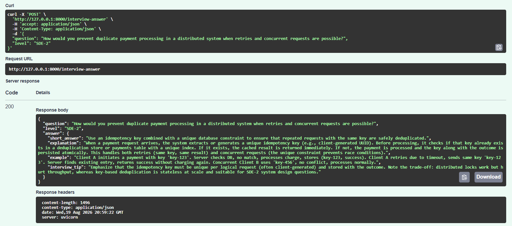

# Mentra AI

Mentra AI is an AI-powered technical interview preparation assistant.

The project is being built step by step to understand how GenAI applications work in practice using Python, FastAPI, Pydantic, prompt engineering, LLM integration, structured output, and RAG.

## Current Features

* FastAPI-based backend
* Pydantic request and response validation
* Interview question and candidate-level input
* Dynamic prompt generation
* OpenRouter LLM integration
* Free-model support through OpenRouter
* AI-generated technical interview answers
* Structured LLM responses
* Pydantic validation for LLM output
* PostgreSQL foundation for RAG
* pgvector support for vector storage
* Automatic Swagger / OpenAPI documentation

## Current Architecture

### Current LLM Flow

```text
Client
  ↓
FastAPI Endpoint
  ↓
Pydantic Request Validation
  ↓
Prompt Generation
  ↓
LLM Service
  ↓
OpenRouter
  ↓
LLM
  ↓
Structured JSON Response
  ↓
JSON Parsing
  ↓
Pydantic Response Validation
  ↓
API Response
```

### RAG Foundation

The RAG pipeline is being added incrementally.

The current database foundation is:

```text
PostgreSQL
  ↓
pgvector
  ↓
knowledge_chunks
```

The retrieval layer is not yet connected to the LLM flow.

## Project Structure

```text
mentra/
├── app/
│   ├── __init__.py
│   ├── main.py
│   ├── models.py
│   ├── config.py
│   ├── prompt.py
│   └── llm_service.py
│
├── sql/
│   └── rag_schema.sql
│
├── .env
├── .env.example
├── .gitignore
├── requirements.txt
├── img.png
└── README.md
```

## Tech Stack

* Python
* FastAPI
* Pydantic
* OpenRouter
* OpenAI-compatible Python SDK
* PostgreSQL
* pgvector
* Uvicorn

## Example Usage

Mentra accepts a technical interview question and the target interview level, then generates a structured interview-oriented response using an LLM.

### Example Request

```json
{
  "question": "How would you prevent duplicate payment processing in a distributed system when retries and concurrent requests are possible?",
  "level": "SDE-2"
}
```

### Example Response

```json
{
  "question": "How would you prevent duplicate payment processing in a distributed system when retries and concurrent requests are possible?",
  "level": "SDE-2",
  "answer": {
    "short_answer": "Use idempotency keys and enforce uniqueness at the persistence layer.",
    "explanation": "Each payment request should carry a unique idempotency key. The backend can store the key with the payment result and return the existing result if the request is retried.",
    "example": "A request with idempotency key payment-123 should create the payment only once even if the client retries the same request.",
    "interview_tip": "Mention idempotency, database constraints, concurrency handling, and retries together."
  }
}
```

The current request flow is:

```text
Request
→ FastAPI
→ Pydantic Request Validation
→ Prompt Generation
→ OpenRouter LLM
→ Structured JSON
→ JSON Parsing
→ Pydantic Response Validation
→ API Response
```

## API Demo

The `/interview-answer` endpoint can be tested directly using FastAPI's Swagger UI.

The API accepts an interview question and candidate level and returns a structured AI-generated response.



## RAG Database Setup

Mentra uses PostgreSQL with pgvector as the foundation for the RAG pipeline.

The schema is stored in:

```text
sql/rag_schema.sql
```

### Schema

```text
knowledge_chunks
+------------+----------------+-----------------------------------------------+
| Column     | Type           | Description                                       |
+------------+----------------+-----------------------------------------------+
| id         | BIGSERIAL      | Unique identifier for each knowledge chunk    |
| content    | TEXT           | Text content of the document chunk            |
| source     | VARCHAR(255)   | Source document or file name                  |
| embedding  | VECTOR(384)    | 384-dimensional embedding for vector search   |
| created_at | TIMESTAMP      | Timestamp when the chunk was stored           |
+------------+----------------+-----------------------------------------------+
```

## Environment Configuration

Create a `.env` file in the project root:

```env
OPENROUTER_API_KEY=your_openrouter_api_key
OPENROUTER_MODEL=openrouter/free

DB_HOST=localhost
DB_PORT=5432
DB_NAME=mentra
DB_USER=postgres
DB_PASSWORD=your_postgres_password
```

Do not commit the `.env` file to GitHub.

Create a `.env.example` file that can safely be committed:

```env
OPENROUTER_API_KEY=your_api_key_here
OPENROUTER_MODEL=openrouter/free

DB_HOST=localhost
DB_PORT=5432
DB_NAME=mentra
DB_USER=postgres
DB_PASSWORD=your_password_here
```

## Run Locally

Create a virtual environment:

```bash
python -m venv .venv
```

Activate it on Windows:

```bash
.venv\Scripts\activate
```

Install dependencies:

```bash
pip install -r requirements.txt
```

Start the application:

```bash
uvicorn app.main:app --reload
```

Verify the backend:

```text
http://127.0.0.1:8000
```

Open Swagger:

```text
http://127.0.0.1:8000/docs
```

## Development Progress

### Day 1 — Backend Foundation

* Initialized the FastAPI application
* Added Pydantic request and response models
* Created the `/interview-answer` endpoint
* Tested the request-response flow using Swagger
* Returned a temporary response before connecting an LLM

### Day 2 — LLM Integration

* Added dynamic prompt generation
* Created a separate LLM service layer
* Integrated OpenRouter
* Configured a free LLM model
* Added environment-based API configuration
* Successfully generated real AI interview answers through the API

### Day 3 — Structured LLM Output

* Updated the prompt to request structured JSON from the LLM
* Added a dedicated `InterviewAnswer` Pydantic model
* Parsed the LLM JSON response into a Python dictionary
* Mapped the structured output to the Pydantic model
* Added validation for the expected LLM response structure
* Updated the API to return a clean nested response

### RAG Day 1 — PostgreSQL + pgvector Foundation

* Added PostgreSQL as the knowledge store for the RAG pipeline
* Enabled pgvector for vector storage and similarity search
* Created the `knowledge_chunks` schema for storing document chunks and embeddings
* Added environment-based PostgreSQL configuration
* Added a reusable SQL schema file for RAG database setup

Current RAG foundation:

```text
PostgreSQL
  ↓
pgvector
  ↓
knowledge_chunks
```

## What I’m Learning

This project is helping me understand how a GenAI application is built beyond simply calling an LLM API:

* API design with FastAPI
* Input/output validation with Pydantic
* Prompt construction
* External LLM integration
* Structured LLM output
* JSON parsing
* Mapping AI output to typed application models
* Environment-based secret management
* PostgreSQL integration
* Vector storage with pgvector
* RAG architecture and retrieval concepts
* Separation of API, configuration, prompt, LLM, and retrieval responsibilities

## Next Step

The next RAG milestone will focus on document ingestion and embeddings.

```text
Document
  ↓
Chunking
  ↓
Embedding Model
  ↓
Vector
  ↓
PostgreSQL + pgvector
```

The goal is to convert technical knowledge into embeddings and store the resulting document chunks and vectors in PostgreSQL for later similarity-based retrieval.
